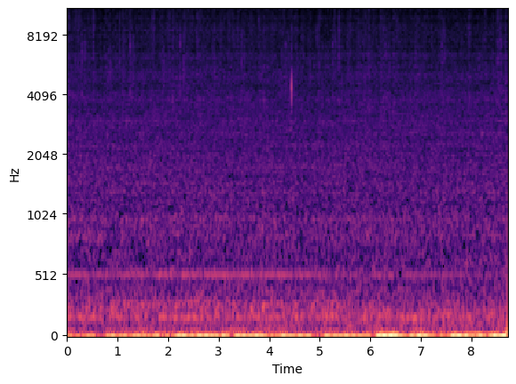
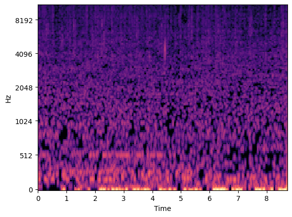

# MIR-Cetacean-Calls

Cetacean Call Examiner
Project Overview

The project described in this report is the Cetacean Call Examiner. It is a simple program that can take audio recordings and classify whether or not they contain cetacean calls, specifically southern resident killer whales or humpback whales, using machine learning algorithms. The program will also include multiple functions that are intended to improve the audibility and clarity of the calls for listeners, particularly for those without prior knowledge or training. The algorithms will be tested both on the raw data as well as the altered data to see how the classification accuracy is affected. Overall, the purpose of the project is to serve as an introduction to bio-acoustic data.

Project Goals

This section outlines the specific goals of the project at different levels.

Basic

Find a suitable cetacean call dataset that can be used for machine learning.

Train a classification model on the calls to classify clips with killer whale calls, humpback whale calls, and no cetacean calls.

Implement spectral gating to de-noise audio samples.

Expected

Implement spectral subtraction to de-noise audio samples.

Implement a human speech de-noising package on the bio-acoustic audio samples.

Train the classification model on de-noised versions of the calls to see if classification accuracy improves in comparison to the baseline.

Extended

Create an algorithm that can identify and mark the beginning and ends of cetacean calls within an audio clip.

Expand the classifier to include data from other labeled datasets.

Project Progress
Status Report

At this stage of the project a suitable dataset has been identified with some preliminary support functions implemented. The dataset used includes 15000 total audio clips, each 3 seconds in length, labelled as either a southern resident killer whale, a humpback whale, or negative (no cetacean call). For this project a small subset of 200 clips for each class will be used for the sake of computational time and storage space. The first de-noising algorithm, spectral gating, has additionally been implemented and tested on a few of the audio clips with limited success.

Deliverables

The source code for the project is available on GitHub:
https://github.com/KCCalder/MIR-Cetacean-Calls

It also includes the subset of the cetacean call dataset that is being used in the project.

Figure 1 shows a spectrogram of one of the southern resident killer whale call audio recordings in its unaltered format.

  

  <em>Figure 1: Spectrogram of an unaltered Southern Resident Killer Whale vocalization</em>

Figure 2 shows a spectrogram of the same call after it is de-noised using spectral gating with a threshold of 1.5.

  

  <em>Figure 2: Spectrogram of a Southern Resident Killer Whale vocalization de-noised using spectral gating</em>

In the current iteration of the project, spectral gating is not effective at isolating and clarifying the killer whale calls. This is because most of the calls do not have an amplitude that is significantly higher than the baseline noise of the audio recording, so filtering primarily using amplitude is not effective.

Figure 1: Spectrogram of an unaltered Southern Resident Killer Whale vocalization

Figure 2: Spectrogram of a Southern Resident Killer Whale vocalization de-noised using spectral gating

Project Timeline

March 22: Train a simple machine learning algorithm to train a classifier on the raw data

March 27: Implement and test other de-noising algorithms on the data

March 29: Re-train the classifier using the de-noised data and see how it affects the classification accuracy

Project Deadline: Complete code documentation and write the report

References

[1] F. Frazao, R. Joy, and M. Dowd, “Comparing acoustic representations for deep learning-based classification of Underwater Acoustic Signals: A Case Study on Orca (orcinus orca) vocalizations,” Ecological Informatics, vol. 90, p. 103297, Dec. 2025. doi:10.1016/j.ecoinf.2025.103297

[2] K. J. Palmer et al., “A public dataset of annotated Orcinus orca acoustic signals for detection and Ecotype classification,” Scientific Data, vol. 12, no. 1, Jul. 2025. doi:10.1038/s41597-025-05281-5

[3] E. Sudheer Kumar, K. Jai Surya, K. Yaswanth Varma, A. Akash, and K. Nithish Reddy, “Noise reduction in audio file using spectral gatting and FFT by Python modules,” Advances in Transdisciplinary Engineering, Jan. 2023. doi:10.3233/atde221305

[4] A. Dhuriya, “Audio enhancement and denoising methods,” Medium.
https://ankurdhuriya.medium.com/audio-enhancement-and-denoising-methods-3644f0cad85b
 (accessed Mar. 19, 2026)

[5] “Orca Acoustics: Orca Behavior Institute,” Orca Behavior Institute.
https://www.orcabehaviorinstitute.org/orca-acoustics
 (accessed Mar. 18, 2026)

[6] E. Vierling, “Salish Sea Humpback Vocalization Catalogue,” Orcasound.
https://www.orcasound.net/portfolio/humpback-catalogue/
 (accessed Mar. 18, 2026)
